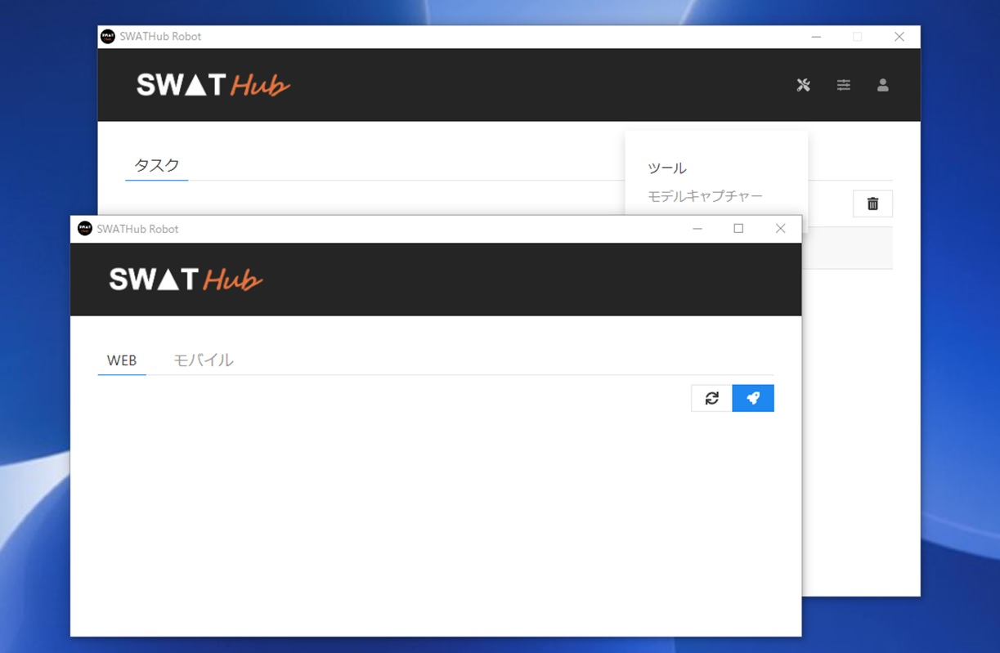
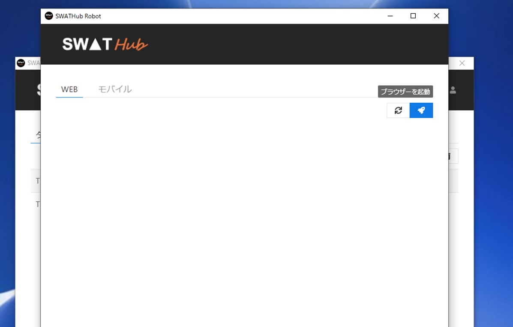
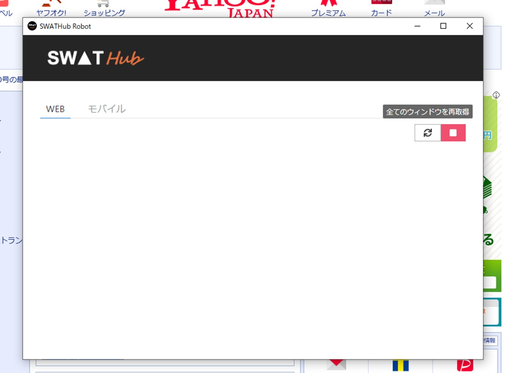
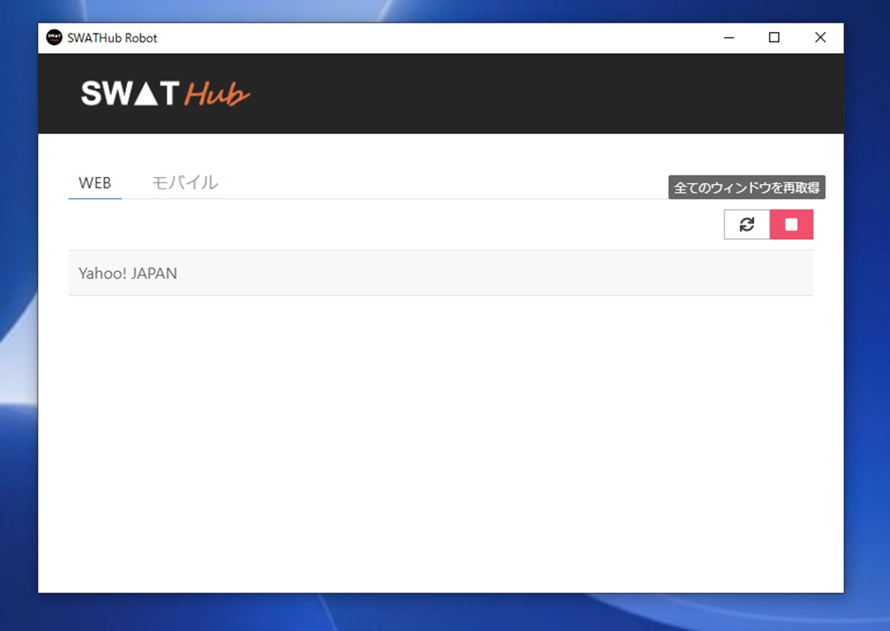
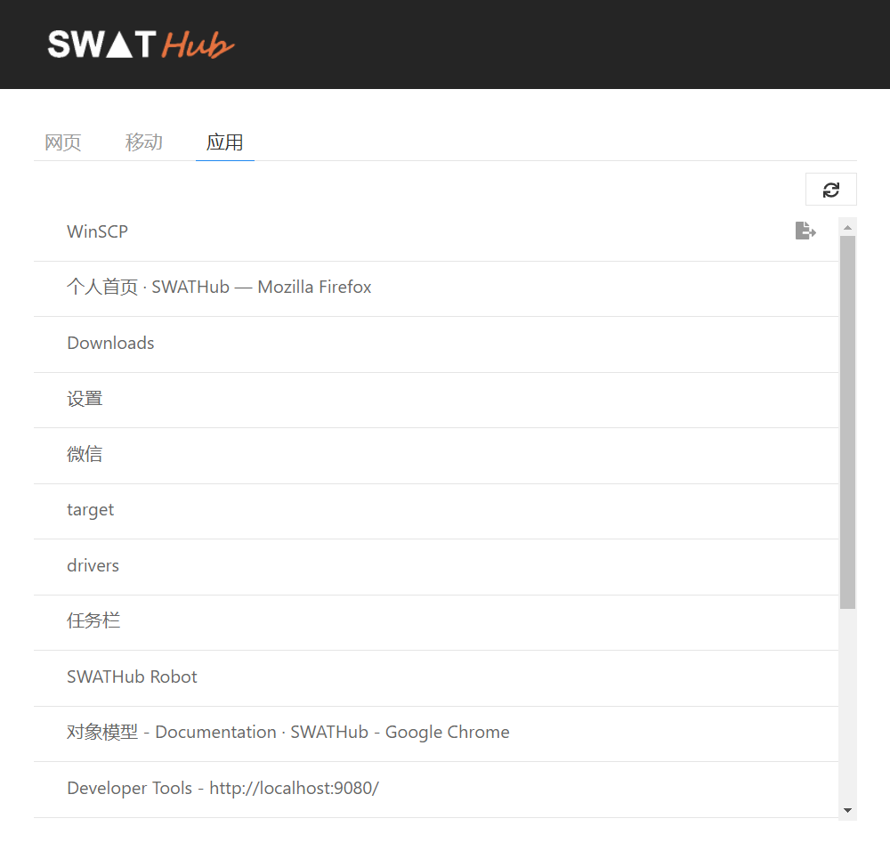
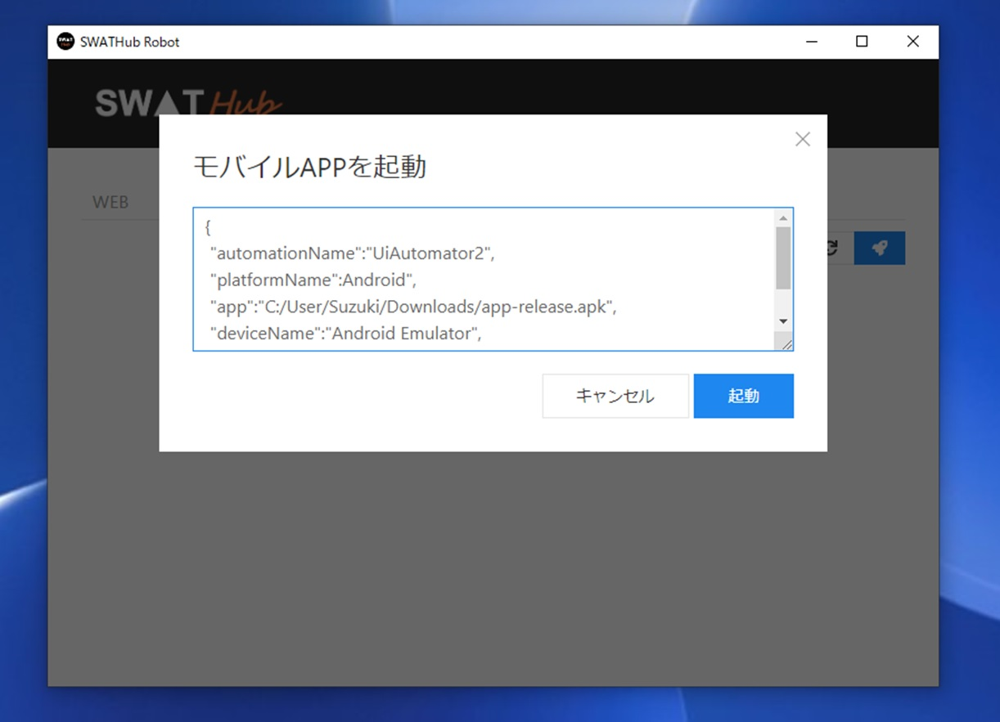
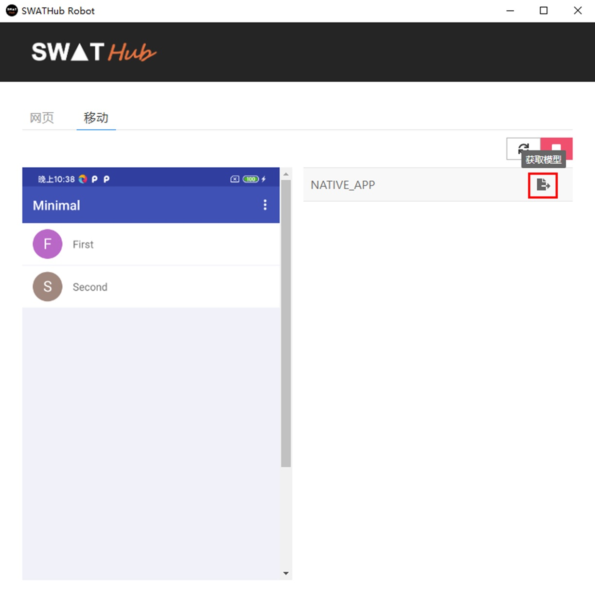

モデルキャプチャーツール
===

SWATHub Robotクライアントツールはモデルキャプチャツールが統合されており、WebモデルとAPPモデルを取得できます。SWATHub Robotの**ツール**メニューから**モデルキャプチャー**を指定し、**Web**または**APP**を選択して、モデル取得操作を開始します。

Webモデルの取得
---

Webモデルを取得する手順は次のとおりです。

1. ロボットメニューから **モデルキャプチャー**を選択、別ウィンドが開き、Webタブを選択し、<i class="fa fa-rocket"></i>をクリックしてブラウザを起動し、Webページファイルの取得に使用するブラウザ1を選択します。

2. **起動**ボタンをクリックすると、指定されたブラウザが開き、**モデルキャプチャー**が起動して、ブラウザで開いたWebページを自動的に取得します。 このとき、選択したブラウザーが自動的に開き、キャプチャー開始ボタンが記録状態に変わります。

3. 開いているブラウザにターゲットWebサイトのURLを入力し、保存が必要なページを開いたら、**全てのウィンドウを再取得**の更新ボタンをクリックしてページファイルを取得します。

4. 保存したモデルファイルは、[モデル](design_model.md)の説明に応じて操作できます。

?> 1. ブラウザを選択する際は、まず現在のコンピュータに対応するブラウザがインストールされていることを確認してください。

Windowsモデルの取得
---

1. ロボットメニューから **モデルキャプチャー**を選択、別ウィンドが開き、アプリケーションタブを選択し、<i class = " fa fa-refresh"></i>をクリックして、現在実行中のすべてのアプリケーションウィンドウを取得します。

2. ウィンドウアイテムの右側の<i class = " fa fa-sign-out"></i>をクリックすれば，Windowsアプリケーションのモデルファイルが方ゾンされます。

3. 保存したモデルファイルを[Windowsモデル](design_model.md#Windowsモデル)にインポートすることができます。

APPモデルの取得
---

APPモデルの取得を開始する前に、モバイル環境設定を完了する必要があります。[モバイル環境設定](robot_mobile_setup.md)を参照してください。SWATHubロボットでAPPモデルを取得する操作手順は次のとおりです。

1. PCで関連するサービスを起動します。AndroidおよびiOSのスマートフォンドライバとJSON形式の機能設定です。[拡張プラットフォーム定義](robot_setup.md#拡張プラットフォーム定義)の説明を参照してください。
2. **モバイルAPPを起動**を選択し、モバイルAPP起動ページが開いたらモバイルアプリを起動する指定をJSON形式で入力します。

3. スマートフォンAPPに接続すると、現在のAPPインターフェイスがモバイルページ取得ツールの左側の表示領域に同期して表示されます。右上のボタンをクリックし<i class="fa fa-refresh"></i>、 APPの現在のビューを更新、現在のAPPページ のファイルエントリが右側のリストに表示されます。エントリ<i class="fa fa-sign-out"></i>の右側をクリックして、指定した場所にモデルファイルとして保存します。

4. 下記の2種類のモデルファイルは保存され、[モデル](design_model.md)の説明に応じて操作できます。

* NATIVE_APP：ネイティブコードを表し、モバイルモデルとしてインポートされた`sview`ファイルとして保存します。
* WebView_1：WebViewの内容を`shtml`ファイルとして保存し、Webモデルとしてインポートします。
