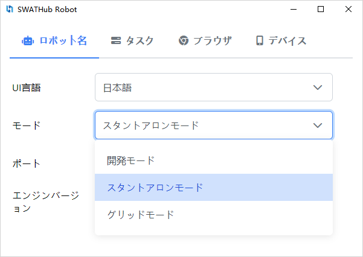
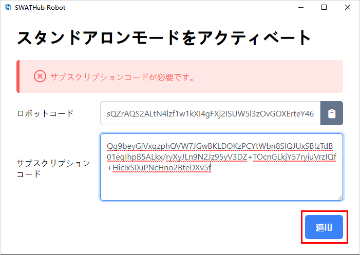
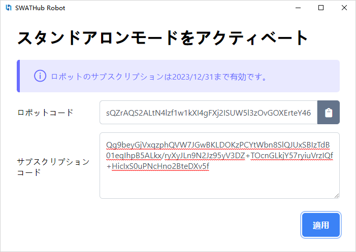
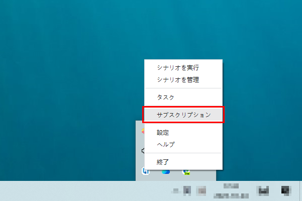
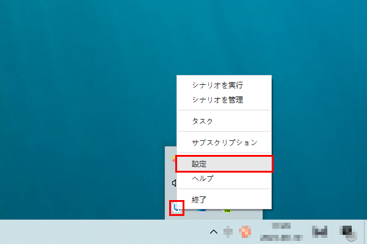
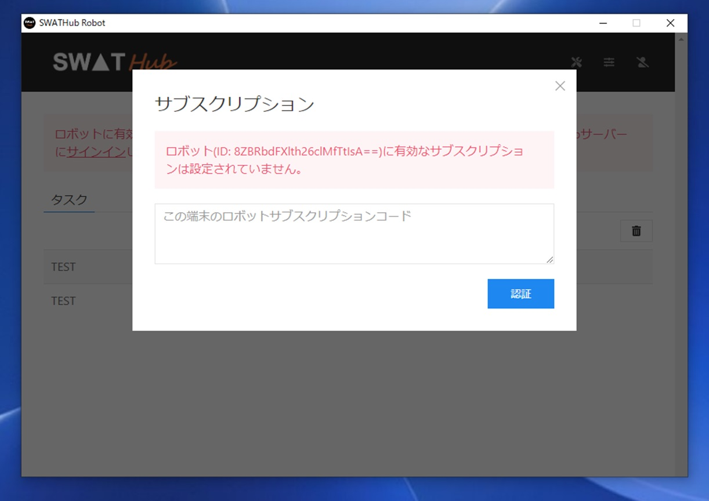
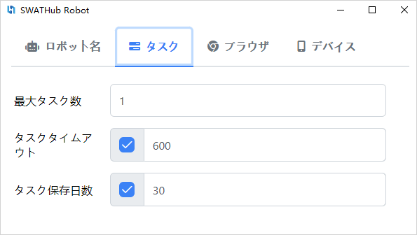
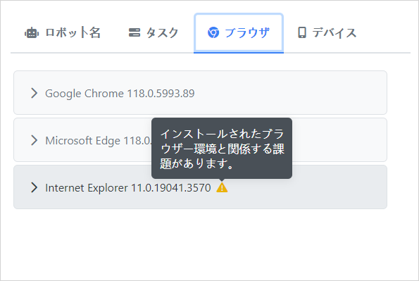
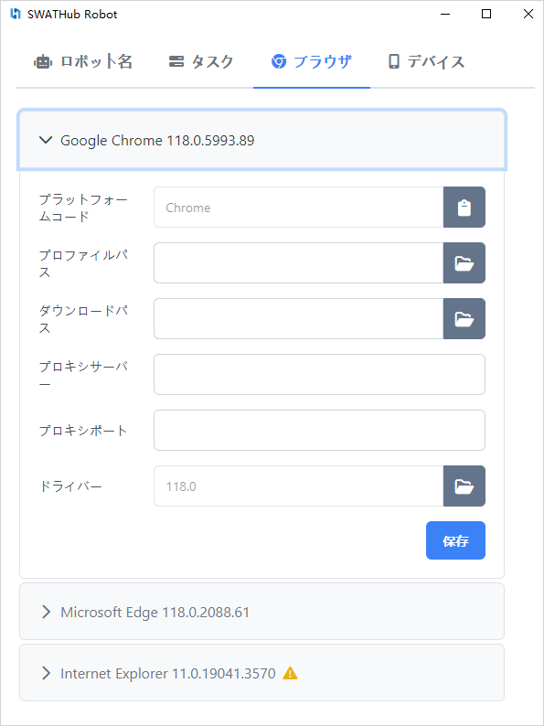

セットアップ
===

インストール
---

### 動作環境

| 項目     | 必要条件
| ------- | -----------
| CPU     | 2.2 GHz (Single Core) 以上<sup>1</sup>
| メモリ  | 4GB<sup>1</sup>
| OS      | Windows 7 以上、Mac OS X 10.6 以上
| ブラウザー | Internet Explorer 8 以上, Microsoft Edge, Firefox, Chrome, Safari
| その他  | 外部アプリを連携する場合、外部アプリが必要です。例えば、Outlookのメール送信機能が使う場合、Outlookのインストールが必要です。

?> 1. 複雑なアプリ連携や、並行実行を求める時に、強いCPUと大きいメモリを用意する必要があります。

### インストール手順

1. SWATHubデザインプラットフォームの**ロボット**メニューから、対応するプラットフォームのSWATHubロボットインストールパッケージをダウンロードします。例えば、`swathub-robot-v1.8.0-x64.zip`などです。[プラットフォームユーザー](design_user.md) - **ロボットのダウンロードとインストール**を参照してください。
1. SWATHubロボットインストールパッケージをインストールディレクトリ<sup>1</sup> <sup>2</sup>に解凍します。
1. SWATHubロボットが使用するオペレーティングシステムとブラウザ<sup>3</sup> <sup>4</sup>を設定します。
1. `swathub-robot.exe`または`swathub-robot`を実行して、SWATHubロボットを起動します。
1. SWATHubロボットを**単一モード**で実行する場合の**サブスクリプション**手順は以下のとおりです。<sup>5</sup>：







現在のサブスクリプションが期限切れの場合は、システムステータスバーのSWATHubロボットメニューで**サブスクリプション**オプションを右クリックし、新しい認証サブスクリプションコードを入力する入力ボックスに入力し、**適用**をクリックして新しいサブスクリプション期間をアクティブにします。



サブスクリプションをアクティブにした後、ローカルプロセスをSWATHubロボットクライアントがある端末にデプロイします。この実行モードは、小規模なビジネスシナリオの自動化に実際に使用されます。

?> 1. リモートネットワークドライブにSWATHubロボットをインストールすると、正常に動作しない場合があります。

?> 2. macOS版のロボットはApplicationディレクトリにコピーする必要があります。任意の一時ディレクトリを使用すると、権限の問題が発生する可能性があります。

?> 3. プロセスの安定性とパフォーマンスを確保するために、[実行環境設定](#実行環境設定)を参照して、対応する設定を完了してください。

?> 4. 携帯電話のブラウザまたは携帯電話のアプリを実行する必要がある場合は、[モバイルプラットフォームを構築する](robot_mobile_setup.md)必要があります。

?> 5. SWATHubロボットが**ノードモード**または**開発モード**で実行されている場合、サブスクリプションをアクティブにする必要はありません。

### プラットフォームバージョン

以下のプラットフォームバージョンのSWATHubロボットを提供しています。

* Windows 64ビット
* macOS

### アップグレード

SWATHubロボットは、SWATHubデザインプラットフォームに接続する際に、現在のロボットとデザインプラットフォームのバージョンが一致しているかどうかを検出し、バージョンが一致しない場合はメッセージが表示されます<sup>1</sup>。この場合、以下の手順に従ってロボットをアップグレードできます。

1. 実行中のSWATHubロボットを閉じます。
2. 必要なバージョンのSWATHubロボットインストールパッケージをダウンロードします。
3. 古いバージョンのSWATHubロボットインストールディレクトリを削除します。
3. SWATHubロボットインストールパッケージを解凍して、インストールディレクトリに配置します。
4. `swathub-robot.exe`または`swathub-robot`を実行して、必要に応じてユーザーデータを自動的にアップグレードします。

?> 1. SWATHubロボットとSWATHubデザインプラットフォームのバージョンが異なる場合、過去に作成されたシーンは正常に動作する可能性がありますが、新しいバージョンの機能を使用するシーンは通常正常に動作しません。

ロボットの設定
---

SWATHubロボットの**設定**メニューを使用して、以下の設定を行うことができます。



### ロボット

* **表示言語**: インターフェースで使用される言語。現在、英語、中国語、日本語がサポートされています。
* **ロボットモード**: 現在の実行要件に基づいて、SWATHubロボットを[開発モード](robot_execution.md)、[単一モード](robot_execution.md)、または[ノードモード](robot_execution.md)で実行します。
* **ローカルポート**: `swathub-desktop`ローカルデザイナーに接続するときのデフォルトポート。使用されていない場合は変更する必要はありません。
* **エンジンバージョン**: 現在のSWATHubロボットエンジンのバージョン番号。




### タスク

* **最大同時実行数**: このオプションは、複数のタスクの同時実行のみを許可します。ユーザーは、ターミナル環境とフロー設計で、複数のタスクがビジネス端末で同時に実行できるようにする必要があります。
* **タスクタイムアウト（秒）**: タスクが実行中に一定時間応答しない場合、タスクの実行が自動的に終了します。秒単位の非負整数を入力します。 `0`の場合、タイムアウト時間は設定されません。
* **タスク保持日数**: 最近のタスクの実行結果を保持する日数。日単位の非負整数を入力します。 `0`の場合、すべての実行結果が保持されます。



### ブラウザ

SWATHubロボットを起動すると、現在のオペレーティングシステムにインストールされている使用可能なブラウザが自動的に検出されます。



各ブラウザディレクトリには、次の設定項目があります。

* **プラットフォームコード**: ブラウザ名がデフォルトで表示されます。
* **設定ファイルパス**: 現在のブラウザで使用されているカスタム設定のパス<sup>1</sup>。 Chromeブラウザの場合は、[Chromeプロファイルの作成](#Chromeプロファイル)を参照してください。 Firefoxブラウザの場合は、[Firefoxプロファイルの作成](#Firefoxプロファイルの作成)を参照してください。
* **ダウンロードパス**: ダウンロードファイルの保存に使用されるカスタム設定のパス。
* **プロキシサーバー**: ブラウザで使用されるプロキシサーバーのサーバーアドレス。
* **プロキシポート**: ブラウザで使用されるプロキシサーバーのサーバーポート。
* **ドライバープログラム**: ブラウザで使用されるドライバープログラムのバージョンコード。現在のドライバープログラムを変更する必要がある場合は、右側のフォルダーボタンをクリックして、ドライバーフォルダーを開き、必要なドライバープログラムファイルを選択します。



?> 1.ブラウザで使用されるダウンロードディレクトリのパス。 IEを使用する場合は、ブラウザの設定と一致する必要があります。

#### Chromeプロファイル

1. 実行中のすべてのChromeインスタンスを閉じます。
2. 異なるオペレーティングシステムでChromeのバイナリを見つけます。
  * (Windows) `%HOMEPATH%\Local Settings\Application Data\Google\Chrome\Application\chrome.exe`
  * (Windows) `%HOMEPATH%\AppData\Local\Google\Chrome\Application\chrome.exe`
  * (Windows) `C:\Program Files\Google\Chrome\Application\chrome.exe`
  * (Windows) `C:\Program Files (x86)\Google\Chrome\Application\chrome.exe`
  * (MacOS) `/Applications/Google Chrome.app/Contents/MacOS/Google Chrome`
3. 下記のコマンドで新しいChromeのプロファイルを作成します。
```batch
chrome.exe --user-data-dir=C:\Dev\chrome-profile
```
4. このプロファイルで必要なブラウザー設定<sup>1</sup>と拡張機能のインストールを行います。

?> 1. Googleに正常にアクセスできない環境の場合、スタートページを`about:blank`に設定してください。

#### Firefoxプロファイル

1. 実行中のすべてのFirefoxインスタンスを閉じます。
2. 異なるオペレーティングシステムでfirefoxのバイナリを見つけます。
  * (Windows) `"C:\Program Files (x86)\Mozilla Firefox\firefox.exe"`
  * (MacOS) `/Applications/Firefox.app/Contents/MacOS/firefox`
3. Firefoxのプロファイルマネージャを起動し、新しいプロファイルを設定します。
```batch
firefox.exe -profilemanager
```
4. 下記のコマンドで作成したプロファイル（`firefox-profile`を例にして）でFirefoxを起動させ、必要なブラウザー設定と拡張機能のインストールを行います。
```batch
firefox.exe -P firefox-profile
```

### デバイス

TODO

実行環境設定
---

ブラウザーのWebDriverを利用してWebアプリを駆動する場合に、ブラウザー自動化に発生する問題を避けるために、一部のOSやブラウザーに対して、設定する必要があります。下記設定が正しいかを是非事前に確認してください。

### OS

#### Windows

* Windowsデスクトップのフォントサイズとスケーリングを`100%`にセットする**必要**があります。
* Windowsで英語以外の文字列を記入が必要な場合は、デフォルトのIMEを英語にしてください。
* ブラウザーのスクロールスクリーンショットを撮る場合、システムのスクロールバーが常に表示されるように設定してください。

#### MacOS

* ブラウザーのスクロールスクリーンショットを撮る場合、システムのスクロールバーが常に表示されるように設定してください。


### デスクトップブラウザー

#### Internet Explorer

* IEのWebDriverを機能するためにいくつかの設定が必要です。例えば、各ゾーンの保護モード設定を同じ値に設定することや、ズームレベルを100％に設定することなど。管理者権限でロボットフォルダーにある`ie.reg`を実行してそれらの設定を実施してください。
* サードパーティのツールバーがIEの実行に影響する可能性がありますので、無効にするかアンインストールしてください。
* 過去の実行からのCookieは次の実行時に残り、影響が出る場合、IEの設定で終了するときにコンテキストデータを削除するようにしてください。
* 証明書のないSSLを利用する場合、ワーニング警告を閉じるために、GUIオペレーションをするか、下記のJavascript実行で対応することが可能です。
```javascript
document.getElementById('overridelink').click();
```
* リモートデスクトップ（RDP）を使用して実行環境を制御し、RDPウィンドウを直接閉じると、Internet Explorerのスクリーンショットが正常に撮れない可能性があります。管理者権限でロボットフォルダーにある`discon.bat`を実行してRDPを閉じることを推奨します。また代わりにVNCを利用することもこの問題が回避できます。
* 注意点
  * その他のGUIの自動化と同様に、自動化操作を行う際に、IEウィンドウを必ずトップになる必要があります。他のキーボード操作や、マウス操作で自動化実行が影響される恐れがあります。
  * 一つのWindowsデスクトップ上に一つのIEプロセスのみ可能のため、IEで並行実行ができません。

#### Microsoft Edge

* ChromiumベースのEdgeはChromeに近いで適切のバージョンのドライバーが必要です。ロボットでEdgeのバージョンを確認し、もしバージョンが不一致の場合に、マイクロソフト社の[WebDriver with Microsoft Edge](https://developer.microsoft.com/en-us/microsoft-edge/tools/webdriver/)から新しいバージョンに対応するドライバーをダンロードして、**設定**ダイアログ**ブラウザー**タブ配下の**ブラウザードライバー格納フォルダーを開く**ボタン <i class="fa fa-folder-open"></i> で開いたフォルダーにあるFirefoxドライバーを上書きしてください。SWATHubロボットは再起動時に新しいドライバーをリロードします。
* 証明書のないSSLを利用する場合、ワーニング警告を閉じるために、GUIオペレーションをするか、下記のJavascript実行で対応することが可能です。
```javascript
document.getElementById('proceed-link').click();
```
* 注意点
  * 通常利用のブラウザー設定の影響をなくすために、Edgeライバーは空白のデフォルトプロファイルでブラウザーを起動させます。
  * Edgeドライバーは複数Edgeプロセスで同時にシナリオを自動実施することができます。また、他のキーボード操作や、マウス操作で自動化実行も影響されません。

#### Microsoft Edge Legacy

* Windows 10にEdgeのドライバーはデフォルトで含まれていないため、マイクロソフト社の[WebDriver with Microsoft Edge](https://developer.microsoft.com/en-us/microsoft-edge/tools/webdriver/)の手順にドライバーをインストールする必要があります。また、古いバージョンのWindows 10の場合、`MicrosoftWebDriver.exe`を手動でダウンロードし、`C:\Windows\System32\`にコピーする必要があります。SWATHubロボットは起動時にEdgeドライバーを自動的に検知できます。
* 証明書のないSSLを利用する場合、ワーニング警告を閉じるために、GUIオペレーションをするか、下記のJavascript実行で対応することが可能です。
```javascript
document.getElementById('overridelink').click();
```
* 注意点
  * Edgeで`http://<username>:<password>@yourdomain`の形でBasic認証のダイアログを飛ばすことができないため、シナリオでGUI操作を使って認証を行ってください。
  * その他のGUIの自動化と同様に、自動化操作を行う際に、Edgeウィンドウを必ずトップになる必要があります。他のキーボード操作や、マウス操作で自動化実行が影響される恐れがあります。
  * 一つのWindowsデスクトップ上に一つのEdgeプロセスのみ可能のため、IEで並行実行ができません。

#### Google Chrome

* SWATHubロボットはインストールされたChromeのバージョンを表示します。ロボットにバンドリングされたドライバーが新しいバージョンに対応しない場合、[Chromeドライバーサイト](https://sites.google.com/a/chromium.org/chromedriver/downloads)から新しいバージョンに対応するドライバーをダンロードして、**設定**ダイアログ**ブラウザー**タブ配下の**ブラウザードライバー格納フォルダーを開く**ボタン <i class="fa fa-folder-open"></i> で開いたフォルダーにあるChromeドライバーを上書きしてください。SWATHubロボットは再起動時に新しいドライバーをリロードします。
* 注意点
  * 通常利用のブラウザー設定の影響をなくすために、Chromeドライバーは空白のデフォルトプロファイルでブラウザーを起動させます。もし特別な設定をしたい場合、SWATHubロボットの**Chromeプロファイル**設定を指定してください。
  * Chromeドライバーは複数Chromeプロセスで同時にシナリオを自動実施することができます。また、他のキーボード操作や、マウス操作で自動化実行も影響されません。

#### Mozilla Firefox

* SWATHubロボットはインストールされたFirefoxのバージョンを表示します。ロボットにバンドリングされたドライバーが新しいバージョンに対応しない場合、[Mozilla Github](https://github.com/mozilla/geckodriver/releases)から新しいバージョンに対応するドライバーをダンロードして、**設定**ダイアログ**ブラウザー**タブ配下の**ブラウザードライバー格納フォルダーを開く**ボタン <i class="fa fa-folder-open"></i> で開いたフォルダーにあるFirefoxドライバーを上書きしてください。SWATHubロボットは再起動時に新しいドライバーをリロードします。
* 注意点
  * 通常利用のブラウザー設定の影響をなくすために、Firefoxドライバーは空白のデフォルトプロファイルでブラウザーを起動させます。もし特別な設定をしたい場合、SWATHubロボットの**Firefoxプロファイル**設定を指定してください。
  * Firefoxドライバーは複数Firefoxプロセスで同時にシナリオを自動実施することができます。また、他のキーボード操作や、マウス操作で自動化実行も影響されません。
  * Firefoxバージョン`47`未満のバージョンは現在サポートされていません。 バージョン`47`〜`59`の場合に、`geckodriver v0.20`を利用してください。`60`以上の場合に、`geckodriver`最新版を利用してください。

#### MacOS Safari

* Safariのバージョン`11`以降の場合、**Develop > Allow Remote Automation**をチェックする**必要**があります。
* 証明書のないSSLを利用する場合、事前にサイトにアクセスし、警告画面にアクセスすることを選択して、該当設定を保存すれば、次回警告画面が出なくなります。
* 注意点
  * Safariで`http://<username>:<password>@yourdomain`の形でBasic認証のダイアログを飛ばすことができないため、シナリオでGUI操作を使って認証を行ってください。
  * Safariドライバーは複数Safariプロセスで同時にシナリオを自動実施することができます。また、他のキーボード操作や、マウス操作で自動化実行も影響されません。

### モバイルブラウザー

#### Android Chrome

* SWATHubロボットは[Appium](http://appium.io/)経由でAndroid Chromeに接続します。SWATHubロボットの[拡張プラットフォーム定義](/ja/ref_setup_robot.md#拡張プラットフォーム定義)設定で、拡張プラットフォームを定義する必要があります。
* 注意点
  * 一つのAndroid上に一つのChromeプロセスのみ可能のため、Chromeで並行実行ができません。

#### iOS Safari

* SWATHubロボットは[Appium](http://appium.io/)経由でiOS Safariに接続します。SWATHubロボットの[拡張プラットフォーム定義](/ja/ref_setup_robot.md#拡張プラットフォーム定義)設定で、拡張プラットフォームを定義する必要があります。
* 証明書のないSSLを利用する場合、事前にサイトにアクセスし、警告画面にアクセスすることを選択して、該当設定を保存すれば、次回警告画面が出なくなります。
* 注意点
  * Safariで`http://<username>:<password>@yourdomain`の形でBasic認証のダイアログを飛ばすことができないため、シナリオでGUI操作を使って認証を行ってください。
  * Webアプリに複数ウィンドウが存在する場合、ウィンドウ間の切り替え時に警告ダイアログが出ます。その際に、手動で確認と切替する必要があります。
  * 一つのiOS上に一つのSafariプロセスのみ可能のため、Safariで並行実行ができません。
