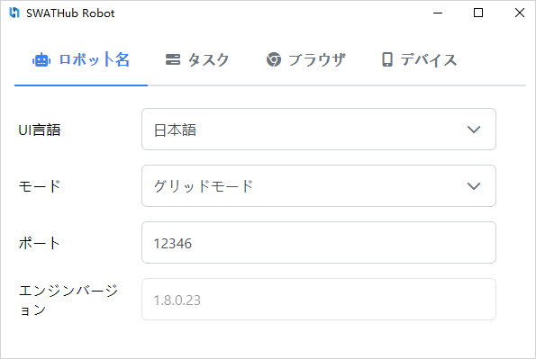

セットアップ
===

インストール
---

### 動作環境

| 項目     | 必要条件
| ------- | -----------
| CPU     | 2.2 GHz (Single Core) 以上<sup>1</sup>
| メモリ  | 4GB<sup>1</sup>
| OS      | Windows 7 以上、Mac OS X 10.6 以上
| ブラウザー | Internet Explorer 8 以上, Microsoft Edge, Firefox, Chrome, Safari
| その他  | 外部アプリを連携する場合、外部アプリが必要です。例えば、Outlookのメール送信機能が使う場合、Outlookのインストールが必要です。

?> 1. 複雑なアプリ連携や、並行実行を求める時に、強いCPUと大きいメモリを用意する必要があります。

### 手順

1. SWATHubサービスの**ロボット**メニューから必要な[プラットフォーム](#対応プラットフォーム)のSWATHubロボットインストールパッケージ（例えば、`swathub-robot-v1.6.0-x64.zip`）をダウンロードします。
2. SWATHubロボットのインストールパッケージをインストールフォルダー<sup>1</sup> <sup>2</sup>に解凍します。
3. SWATHubロボットが動く端末のOSとブラウザー<sup>3</sup> <sup>4</sup>を設定します。
4. `SWATHubRobot.exe`もしくは`SWATHubRobot`でSWATHubロボットを起動させます。
5. SWATHubロボットの[サブスクリプションを有効化](#サブスクリプション有効化)します。

?> 1. リモートディスクにイントールする場合に、SWATHubロボットが正常に動かない恐れがあります。

?> 2. macOS版の場合、Applicationフォルダにコピーするようにお願いします。その他フォルダで実行すると、権限のエラーが出る恐れがあります。

?> 3. シナリオ実行の安定性と性能を保つために、[実行環境設定](#実行環境設定)を参考して、設定を行ってください。

?> 4. スマホ端末でブラウザやAPPを利用する場合に、別途[モバイル環境設定](robot_mobile_setup.md)を実施する必要があります。

### 対応プラットフォーム

下記のプラットフォームのSWATHubロボットを提供しています。

* Windows 32位
* Windows 64位
* macOS

### サブスクリプション有効化

SWATHubロボットは**オフライン端末サブスクリプション**と**オンラインユーザーサブスクリプション**二種類のサブスクリプションを持っています。**オフライン端末サブスクリプション**は特定な端末にSWATHubロボットの利用を有効化させます。有効化の手順は下記になります。**オンラインユーザーサブスクリプション**の場合、SWATHubサービスのユーザー認証情報でロボットをサーバーに接続する際に自動的に有効化されます<sup>1</sup>。

1. SWATHubロボットの**設定 > サブスクリプション**メニューから**サブスクリプション**ダイアログを開きます。
2. ステータスに記述したロボットID<sup>2</sup>を使ってサブスクリプションコードを申請します。
3. サブスクリプションを取得後、コードを記入して**認証**ボタンをクリックし按钮，ロボットのサブスクリプションステータスを確認します。
4. **サブスクリプション**ダイアログを閉じます。



?> 1. ユーザーサブスクリプションの種類によって、同一ユーザーから有効化できるロボットの数に制限があります。

?> 2. ロボットIDとインストールされた端末と一対一の関係を持っています。端末が変更した場合、このIDも変わり、サブスクリプションが失効されます。

### アップグレード

SWATHubロボットはSWATHubサーバーに接続する際に、ロボットとサーバーのバージョンが一致するかどうかをチェックします。一致しない場合、ワーニングメッセージ<sup>1</sup>が出ます。下記の手順でロボットのアップグレードをお願いします。

1. 現在実行中のSWATHubロボットを停止させます。（最小化ではなく）。
2. SWATHubサービスから最新のSWATHubロボットのインストールパッケージをダウンロードします。
3. 旧バージョンのSWATHubロボットのインストールフォルダーを削除します。
2. 新しいインストールパッケージをインストールフォルダーに解凍します。
4. `SWATHubRobot.exe`もしくは`SWATHubRobot`でSWATHubロボットを起動させ、ユーザーデータは自動的にアップデートします。

?> 1. SWATHubロボットはSWATHubサーバーとバージョンが異なる場合、過去作成したシナリオが正常に動くことが可能ですが、新しいバージョンでの新機能を利用するシナリオが動きません。

ロボット設定
---

SWATHubロボットの**設定 > 設定**メニューから**ロボット設定**ダイアログを開き、下記の設定ができます。

### ロボット

* **ロボット名**: SWATHubサービスに接続した時のこのロボットの名前。デフォルトは端末のIPです。
* **言語**: ロボットUIの言語です。英語、中国語、日本語は対応されています。
* **利用スコープ**: SWATHubサービスのワークスペース上このロボットが利用できる範囲です。**ユーザー**を選択する場合、該当ロボットでサインインしたユーザーのみ利用可能です。**ワークスペース**を選択する場合、このワークスペースの全てのメンバーが利用可能です。このオプションはオンライン設計モードのみ有効です。
* **並行タスク数上限**: 同時に実行できるタスクの数<sup>1</sup>。正の整数を使用してください。
* **プロキシホスト**: HTTPプロキシでSWATHubサーバーに接続する時のプロキシサーバーのホスト。
* **プロキシポート**: HTTPプロキシでSWATHubサーバーに接続する時のプロキシサーバーのポート。正の整数を使用してください。
* **プロキシユーザー名**: HTTPプロキシでSWATHubサーバーに接続する時のユーザー名。
* **プロキシパスワード**: HTTPプロキシでSWATHubサーバーに接続する時のパスワード。


?> 1. このオプションでロボットの制限を定義しますが、ユーザーは別途端末の環境上とシナリオの設計上同時実行を保証する必要があります。

### タスク

* **デフォルトブラウザー**: タスクにブラウザーの指定がない場合、このオプションのブラウザーを利用します。端末に検知したブラウザーのみ表示されます。
* **タスクタイムアウト**: 応答なしのタスクを完了させるタイムアウト。正整数を使用。`0`を設定する場合、タイムアウトは機能しません。
* **タスク保存日数**: タスク実行結果を自動的にクリアするまでの日数です。正整数を使用。`0`を設定する場合、実行結果を自動的にクリアしません。
* **WebベースURL**: タスクにWebベースURLの指定がないかつシナリオのブラウザーに相対URLを利用した場合、このWebベースURLをブラウザーで利用します。
* **APIベースURL**: タスクにAPIベースURLの指定がないかつシナリオのAPIに相対URLを利用した場合、
このAPIベースURLをAPIオペレーションで利用します。


### ブラウザー

* **ダウンロードフォルダー**: ブラウザーのダウンロードディレクトリ。IEを利用する場合、IE側の設定と一致する必要があります。
* **Chromeプロファイル**: カスタム[Chromeのプロファイル](#Chromeプロファイル)のパス。
* **Firefoxプロファイル**: カスタム[Firefoxのプロファイル](#Firefoxプロファイル)のパス。
* **Edgeプロファイル**: カスタムEdgeのプロファイルのパス。
* **プロキシホスト**: 実行ブラウザで利用したプロキシサーバーのホスト。
* **プロキシポート**: 実行ブラウザで利用したプロキシサーバーのポート。正の整数を使用してください。


#### Chromeプロファイル

1. 実行中のすべてのChromeインスタンスを閉じます。
2. 異なるオペレーティングシステムでChromeのバイナリを見つけます。
  * (Windows) `%HOMEPATH%\Local Settings\Application Data\Google\Chrome\Application\chrome.exe`
  * (Windows) `%HOMEPATH%\AppData\Local\Google\Chrome\Application\chrome.exe`
  * (Windows) `C:\Program Files\Google\Chrome\Application\chrome.exe`
  * (Windows) `C:\Program Files (x86)\Google\Chrome\Application\chrome.exe`
  * (MacOS) `/Applications/Google Chrome.app/Contents/MacOS/Google Chrome`
3. 下記のコマンドで新しいChromeのプロファイルを作成します。
```batch
chrome.exe --user-data-dir=C:\Dev\chrome-profile
```
4. このプロファイルで必要なブラウザー設定<sup>1</sup>と拡張機能のインストールを行います。

?> 1. Googleに正常にアクセスできない環境の場合、スタートページを`about:blank`に設定してください。

#### Firefoxプロファイル

1. 実行中のすべてのFirefoxインスタンスを閉じます。
2. 異なるオペレーティングシステムでfirefoxのバイナリを見つけます。
  * (Windows) `"C:\Program Files (x86)\Mozilla Firefox\firefox.exe"`
  * (MacOS) `/Applications/Firefox.app/Contents/MacOS/firefox`
3. Firefoxのプロファイルマネージャを起動し、新しいプロファイルを設定します。
```batch
firefox.exe -profilemanager
```
4. 下記のコマンドで作成したプロファイル（`firefox-profile`を例にして）でFirefoxを起動させ、必要なブラウザー設定と拡張機能のインストールを行います。
```batch
firefox.exe -P firefox-profile
```

### 高度な設定

* **拡張プラットフォーム定義**: SWATHubロボットで接続できる拡張プラットフォーム（例えば、モバイル環境）のJSON定義です。


#### 拡張プラットフォーム定義

SWATHubロボットはインストールされる端末上の各種ブラウザーが利用できるほか、WebDriver接続仕様と互換性のある拡張プラットフォームに接続できます。例えば、[Appium](http://appium.io/)、[Selenium Grid](https://github.com/SeleniumHQ/selenium/wiki/Grid-Platforms)、[BrowserStack](http://www.browserstack.com)と[Sauce Labs](https://saucelabs.com)のクラウドサービスなど。

それらの拡張プラットフォームに接続するために、下記のJSON構文で拡張プラットフォームのリストを定義する必要があります。

* `remoteURL` (必須): 拡張プラットフォームのサービスのRemote WebDriver APIのURL。
* `code` (必須): ブラウザーリストに表示される拡張プラットフォームのコード、任意の文字列が利用可能です。
* `definition` (必須): 拡張プラットフォームの情報。
  * `os` (必須): OS名。支持`Windows`、`macOS`、`Linux`、`iOS`、`Android`。
  * `osVer`: OSのバージョン。
  * `browser` (必須): ブラウザー名。支持`IE`、`Edge`、`Firefox`、`Chrome`、`Safari`、`Browser`。
  * `browserVer`: ブラウザーのバージョン。
* `capabilities`: プラットフォームの駆動仕様、このプラットフォームがサポートするWebDriver Capabilitiesのキーとバリューが使えます。

下記はAppiumでモバイルプラットフォームに接続の拡張プラットフォーム定義の例です。

```json
[
  {
    "remoteURL": "http://localhost:4723/wd/hub",
    "code": "iOS 11 Safari",
    "definition": {
      "os":"iOS",
      "osVer":"9.1",
      "browser":"Safari",
      "browserVer":"9"
    },
    "capabilities":{
      "udid":"YOUR_DEVICE_UDID",
      "deviceName":"iPhone",
      "platformName":"iOS",
      "browserName":"Safari",
      "platformVersion":"9.1"
    }
  },
  {
    "remoteURL": "http://localhost:4723/wd/hub",
    "code": "Android Chrome",
    "definition": {
      "os": "Android",
      "osVer": "4.4",
      "browser": "Chrome",
      "browserVer": "66"
    },
    "capabilities": {
      "deviceName": "Android",
      "platformName": "Android",
      "browserName": "Chrome"
    }
  }
]
```

実行環境設定
---

ブラウザーのWebDriverを利用してWebアプリを駆動する場合に、ブラウザー自動化に発生する問題を避けるために、一部のOSやブラウザーに対して、設定する必要があります。下記設定が正しいかを是非事前に確認してください。

### OS

#### Windows

* Windowsデスクトップのフォントサイズとスケーリングを`100%`にセットする**必要**があります。
* Windowsファイアウォールが有効の場合、`IEDriverServer.exe`または`chromedriver.exe`の通信を許可してください。
* Windowsで英語以外の文字列を記入が必要な場合は、デフォルトのIMEを英語にしてください。

#### MacOS

* ブラウザーのスクロールスクリーンショットを撮る場合、システムのスクロールバーが常に表示されるように設定してください。


### デスクトップブラウザー

#### Internet Explorer

* IEのWebDriverを機能するためにいくつかの設定が必要です。例えば、各ゾーンの保護モード設定を同じ値に設定することや、ズームレベルを100％に設定することなど。管理者権限でロボットフォルダーにある`ie.reg`を実行してそれらの設定を実施してください。
* サードパーティのツールバーがIEの実行に影響する可能性がありますので、無効にするかアンインストールしてください。
* 過去の実行からのCookieは次の実行時に残り、影響が出る場合、IEの設定で終了するときにコンテキストデータを削除するようにしてください。
* 証明書のないSSLを利用する場合、ワーニング警告を閉じるために、GUIオペレーションをするか、下記のJavascript実行で対応することが可能です。
```javascript
document.getElementById('overridelink').click();
```
* リモートデスクトップ（RDP）を使用して実行環境を制御し、RDPウィンドウを直接閉じると、Internet Explorerのスクリーンショットが正常に撮れない可能性があります。管理者権限でロボットフォルダーにある`discon.bat`を実行してRDPを閉じることを推奨します。また代わりにVNCを利用することもこの問題が回避できます。
* 注意点
  * その他のGUIの自動化と同様に、自動化操作を行う際に、IEウィンドウを必ずトップになる必要があります。他のキーボード操作や、マウス操作で自動化実行が影響される恐れがあります。
  * 一つのWindowsデスクトップ上に一つのIEプロセスのみ可能のため、IEで並行実行ができません。

#### Microsoft Edge

* ChromiumベースのEdgeはChromeに近いで適切のバージョンのドライバーが必要です。ロボットでEdgeのバージョンを確認し、もしバージョンが不一致の場合に、マイクロソフト社の[WebDriver with Microsoft Edge](https://developer.microsoft.com/en-us/microsoft-edge/tools/webdriver/)から新しいバージョンに対応するドライバーをダンロードして、**設定**ダイアログ**ブラウザー**タブ配下の**ブラウザードライバー格納フォルダーを開く**ボタン <i class="fa fa-folder-open"></i> で開いたフォルダーにあるFirefoxドライバーを上書きしてください。SWATHubロボットは再起動時に新しいドライバーをリロードします。
* 証明書のないSSLを利用する場合、ワーニング警告を閉じるために、GUIオペレーションをするか、下記のJavascript実行で対応することが可能です。
```javascript
document.getElementById('proceed-link').click();
```
* 注意点
  * 通常利用のブラウザー設定の影響をなくすために、Edgeライバーは空白のデフォルトプロファイルでブラウザーを起動させます。
  * Edgeドライバーは複数Edgeプロセスで同時にシナリオを自動実施することができます。また、他のキーボード操作や、マウス操作で自動化実行も影響されません。

#### Microsoft Edge Legacy

* Windows 10にEdgeのドライバーはデフォルトで含まれていないため、マイクロソフト社の[WebDriver with Microsoft Edge](https://developer.microsoft.com/en-us/microsoft-edge/tools/webdriver/)の手順にドライバーをインストールする必要があります。また、古いバージョンのWindows 10の場合、`MicrosoftWebDriver.exe`を手動でダウンロードし、`C:\Windows\System32\`にコピーする必要があります。SWATHubロボットは起動時にEdgeドライバーを自動的に検知できます。
* 証明書のないSSLを利用する場合、ワーニング警告を閉じるために、GUIオペレーションをするか、下記のJavascript実行で対応することが可能です。
```javascript
document.getElementById('overridelink').click();
```
* 注意点
  * Edgeで`http://<username>:<password>@yourdomain`の形でBasic認証のダイアログを飛ばすことができないため、シナリオでGUI操作を使って認証を行ってください。
  * その他のGUIの自動化と同様に、自動化操作を行う際に、Edgeウィンドウを必ずトップになる必要があります。他のキーボード操作や、マウス操作で自動化実行が影響される恐れがあります。
  * 一つのWindowsデスクトップ上に一つのEdgeプロセスのみ可能のため、IEで並行実行ができません。

#### Google Chrome

* SWATHubロボットはインストールされたChromeのバージョンを表示します。ロボットにバンドリングされたドライバーが新しいバージョンに対応しない場合、[Chromeドライバーサイト](https://sites.google.com/a/chromium.org/chromedriver/downloads)から新しいバージョンに対応するドライバーをダンロードして、**設定**ダイアログ**ブラウザー**タブ配下の**ブラウザードライバー格納フォルダーを開く**ボタン <i class="fa fa-folder-open"></i> で開いたフォルダーにあるChromeドライバーを上書きしてください。SWATHubロボットは再起動時に新しいドライバーをリロードします。
* 注意点
  * 通常利用のブラウザー設定の影響をなくすために、Chromeドライバーは空白のデフォルトプロファイルでブラウザーを起動させます。もし特別な設定をしたい場合、SWATHubロボットの**Chromeプロファイル**設定を指定してください。
  * Chromeドライバーは複数Chromeプロセスで同時にシナリオを自動実施することができます。また、他のキーボード操作や、マウス操作で自動化実行も影響されません。

#### Mozilla Firefox

* SWATHubロボットはインストールされたFirefoxのバージョンを表示します。ロボットにバンドリングされたドライバーが新しいバージョンに対応しない場合、[Mozilla Github](https://github.com/mozilla/geckodriver/releases)から新しいバージョンに対応するドライバーをダンロードして、**設定**ダイアログ**ブラウザー**タブ配下の**ブラウザードライバー格納フォルダーを開く**ボタン <i class="fa fa-folder-open"></i> で開いたフォルダーにあるFirefoxドライバーを上書きしてください。SWATHubロボットは再起動時に新しいドライバーをリロードします。
* 注意点
  * 通常利用のブラウザー設定の影響をなくすために、Firefoxドライバーは空白のデフォルトプロファイルでブラウザーを起動させます。もし特別な設定をしたい場合、SWATHubロボットの**Firefoxプロファイル**設定を指定してください。
  * Firefoxドライバーは複数Firefoxプロセスで同時にシナリオを自動実施することができます。また、他のキーボード操作や、マウス操作で自動化実行も影響されません。
  * Firefoxバージョン`47`未満のバージョンは現在サポートされていません。 バージョン`47`〜`59`の場合に、`geckodriver v0.20`を利用してください。`60`以上の場合に、`geckodriver`最新版を利用してください。


#### MacOS Safari

* Safariのバージョン`11`以降の場合、**Develop > Allow Remote Automation**をチェックする**必要**があります。
* 証明書のないSSLを利用する場合、事前にサイトにアクセスし、警告画面にアクセスすることを選択して、該当設定を保存すれば、次回警告画面が出なくなります。
* 注意点
  * Safariで`http://<username>:<password>@yourdomain`の形でBasic認証のダイアログを飛ばすことができないため、シナリオでGUI操作を使って認証を行ってください。
  * Safariドライバーは複数Safariプロセスで同時にシナリオを自動実施することができます。また、他のキーボード操作や、マウス操作で自動化実行も影響されません。

### モバイルブラウザー

#### Android Chrome

* SWATHubロボットは[Appium](http://appium.io/)経由でAndroid Chromeに接続します。SWATHubロボットの[拡張プラットフォーム定義](/ja/ref_setup_robot.md#拡張プラットフォーム定義)設定で、拡張プラットフォームを定義する必要があります。
* 注意点
  * 一つのAndroid上に一つのChromeプロセスのみ可能のため、Chromeで並行実行ができません。

#### iOS Safari

* SWATHubロボットは[Appium](http://appium.io/)経由でiOS Safariに接続します。SWATHubロボットの[拡張プラットフォーム定義](/ja/ref_setup_robot.md#拡張プラットフォーム定義)設定で、拡張プラットフォームを定義する必要があります。
* 証明書のないSSLを利用する場合、事前にサイトにアクセスし、警告画面にアクセスすることを選択して、該当設定を保存すれば、次回警告画面が出なくなります。
* 注意点
  * Safariで`http://<username>:<password>@yourdomain`の形でBasic認証のダイアログを飛ばすことができないため、シナリオでGUI操作を使って認証を行ってください。
  * Webアプリに複数ウィンドウが存在する場合、ウィンドウ間の切り替え時に警告ダイアログが出ます。その際に、手動で確認と切替する必要があります。
  * 一つのiOS上に一つのSafariプロセスのみ可能のため、Safariで並行実行ができません。
