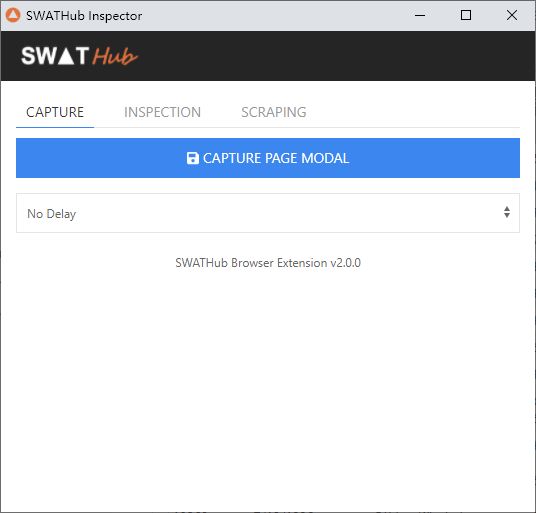
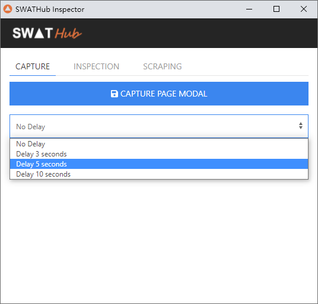
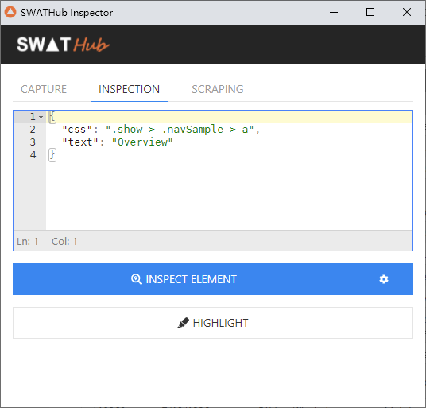
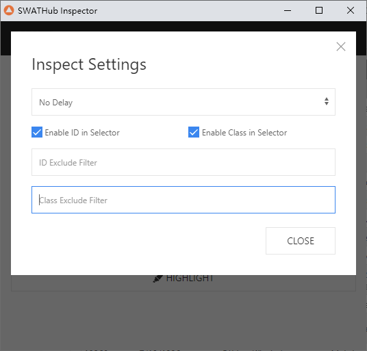
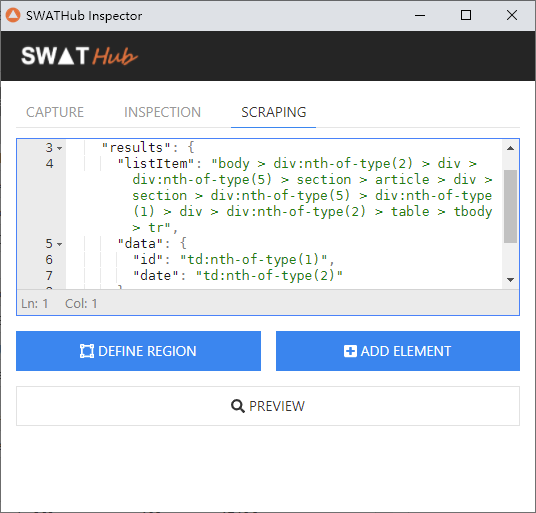
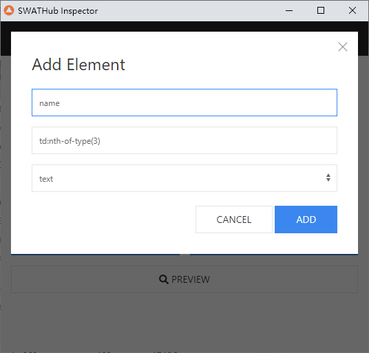
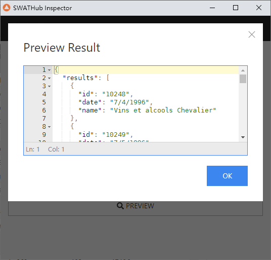

SWATHubブラウザ拡張機能
===

SWATHubはWebアプリのモデルのキャプチャーやエレメントのセレクターの取得などを便利に行うために、**SWATHub Browser Extension**1と呼ぶブラウザの拡張機能を提供しています。現在[Web画面のモデル](../dev/model_web)，[Webエレメントのセレクター](../dev/sop_webapp#webエレメントのセレクター)と[Webスクレイピングのルール](../dev/sop_webapp#webスクレイピング)の取得を対応しています。

?> 1. SWATHubブラウザ拡張機能は現在Chrome、FirefoxとEdgeを対応しています。IEでWebモデルのキャプチャーをキャプチャーする場合に従来の[モデルキャプチャツール](design_model#webモデル取得)を利用してください。

インストール
---

| ブラウザ       | ダウンロード情報　 | 要求 | 拡張機能設定URL
| ---------- | -----------   | ----------- | -----------
| Google Chrome | [Chrome Web Store](https://chrome.google.com/webstore/detail/swathub-inspector/mgjolppchlcakohembjnblmejhohpjio)  [オフラインパッケージ](tools/swathub-inspector_v2.0.0.zip)| Google Chrome 31以上 | `chrome://extensions`
| Mozilla Firefox | [オフラインパッケージ](tools/swathub-inspector_v2.0.0.xpi)| Mozilla Firefox 59以上 | `about:addons`
| Windows Edge | [オフラインパッケージ](tools/swathub-inspector_v2.0.0.zip)| Windows Edge 76以上 | `edge://extensions`

### インストール手順

1. ブラウザを開き、アドレスバーで上記の拡張機能設定URLを入れて、アクセスします。
2. ChromeとEdgeの場合に、画面にある開発者モードをオンにします。
3. ダウンロードしたオフラインパッケージを該当画面にドラッグ＆ドロップして、自動的にインストールされます。

Webモデル取得
---

ブラウザで対象画面にアクセスし、SWATHubブラウザ拡張機能のアイコンをクリックします。「**CAPTURE**」のタブの配下で、**CAPTURE PAGE MODEL**ボタンをクリックすれば良いです。

もし画面の要素の表示にマウスのフォーカスが必要の場合に（例えば一部プルダウンメニューとか）、下の`DELAY`時間を秒単位に設定して、**CAPTURE PAGE MODEL**ボタンをクリックしてすぐにフォーカスして、`DELAY`時間が過ぎたタイミングで自動的にモデルキャプチャーがされます。

Webエレメントセレクター取得
---

ブラウザで対象画面にアクセスし、SWATHubブラウザ拡張機能のアイコンをクリックします。「**INSPECT**」のタブの配下で、**INSPECT ELEMENT**ボタンをクリックし、ブラウザの画面に対象エレメントをクリックします。上のJSONエディターにこのエレメントのセレクターが表示されます。そのまま[Webアプリシステムオペレーション](../dev/sop_webapp)で利用することも可能です。

もしエレメントのセレクターを手動で編集して検証をする場合に、編集した後に**HIGHLIGHT**ボタンをクリックして、該当セレクターでローケーティングするエレメントをハイライトします。

セレクター生成する場合に**INSPECT ELEMENT**の後ろの設定ボタンを押して、下記の設定が可能です。

* `DELAY`時間を設定して、INSPECTとHIGHLIGHTのタイミングをずらすことが可能です。その間、手動の操作で、画面要素を表示させったりすることが可能です。
* IDが動的に生成される場合に、IDを使ったセレクターが利用できなくなる可能性があります。その場合に`Enable ID in Selector`をオフにして、他の属性を利用してセレクターを生成する必要があります。また、`ID Exclude Filter`を使って、特定な特徴のあるIDを利用しないように設定することも可能です。例えば、`[0-9A-Z]{8}`のフィルタを利用すると、英数字の8桁IDを利用しなくなります。
* IDと同じように`Enable Class in Selector`をオフにすると、エレメントのCSS属性を利用しなくなります。`Class Exclude Filter`を使って、特定な特徴のあるCSS属性を利用しないように設定することも可能です。例えば、`hover|focus`でマウスがホバーした状態で動的に生成される`ui-state-hover`と`ui-state-focus`属性を無視します。

Webスクレイピングルール取得
---

[Webスクレイピング](../dev/sop_webapp#webスクレイピング)を使って、Web画面からテーブルやリストなど大量なデータを取得する場合に、Webスクレイピングルールを利用する必要があります。その場合に、**SCRAPING**」のタブの配下の機能でWebスクレイピングルールを生成することが可能です。

1. **DEFINE REGION**ボタンをクリックして、ポップアップされたメッセージに従い、テーブルなどのエリアに二つ同レベルの要素（例えば、テーブルの2行）をクリックすれば、このエリアのルールが生成されます。
2. **PREVIEW**ボタンをクリックして、このエリアのテキストは自動的に生成されます。それを使って、正しくエリアを定義したかを確認します。
3. **ADD ELEMENT**ボタンをクリックして、該当エリアに必要なデータを選んで、データの名前を付けます。例えば、下記の図のように、３列目のセルのテキストを`name`にネーミングして出力します。テキスト以外に、`value`や`href`などのデータを出力することも可能です。

4. 上記の**ADD ELEMENT**のステップを必要に応じて複数回で行うことが可能です。完了した時点で再度**PREVIEW**ボタンをクリックして、下記のようなJSONのスクレーピング結果が出ます。配列の数はテーブルの行数で、配列の属性は先ほど手動で追加した対象データです。

5. JSONのルールを手動で編集することも可能です。編集した後に、**PREVIEW**を使って予期した結果が出るかどうかを確認してください。