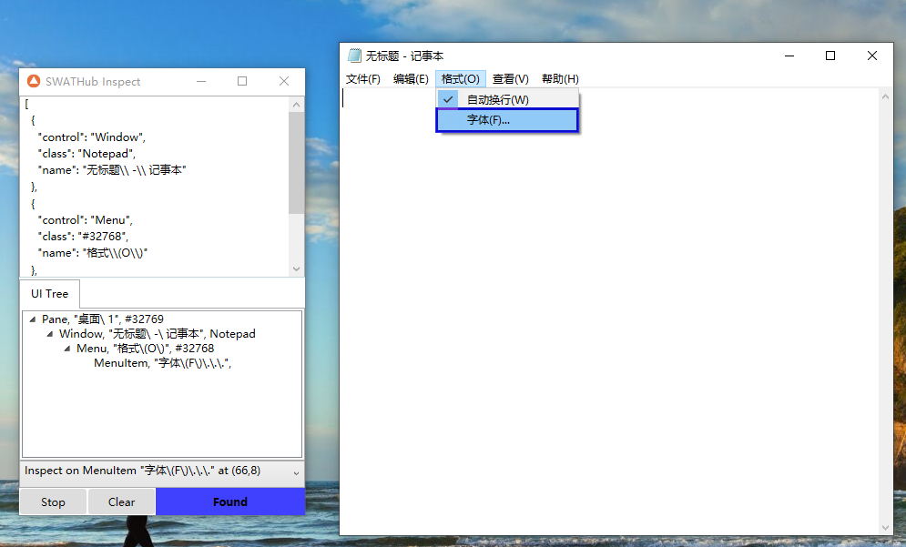

WINインスペクター
===

SWATHubロボットに「WINインスペクター」1のツールは含まれています2。

?> 1. WINインスペクターは現在64bitのWindows 10のみ対応しています、パスは `%appdata%\swathub-robot\addons\<version>\system\SWATHubInspect` に位置しています。

?> 2. 一部のWindowsでツールが開ない問題があります。その場合に、[Microsoft Visual C++ Redistributable](https://aka.ms/vs/16/release/vc_redist.x64.exe)をインストールしてから再度ツールを開いてみてください。

Windowsコントロールの選択
---

Windowsコントロールの選択は下記のステップで行います。

1. ロボットの**ツール**メニューから**WINインスペクター**画面に入って、`Inspect`ボタンを押して、コントロールの検索モードに入ります。マウスを選択する対象のアプリケーション1の該当コントロールに移動し、少し待っていれば、該当コントロールの外に青い枠が出て、ツールの画面に該当コントロールのセレクターが表示されます。またセレクターの下に参考用のWindows UIツリーも表示されます。

2. `Stop`ボタンをクリックし、検索モードを停止します。上部のJSON表示に右クリックして、`Copy Full JSON`を選択し、その内容をWindowsアプリのシステムオペレーションのデータに貼り付けます。

3. 自動生成されるセレクターの階層が多い可能性がありますので、手動でJSONを改修して、不要な階層や、属性などを削除したり、`name`などの属性を正規表現に変更したりすることが可能です。改修したセレクターを検証するために、右クリックして、`Highlight`2を選択すれば、改修後のセレクターの対象コントロールがハイライトされます。

?> 1. 「タスクマネージャー」などのシステムレベルのアプリを検出する場合に、管理者権限でSWATHubロボットを起動する必要があります。

?> 2. 非表示のメニューみたいにマウスクリックなどの操作で表示されるコントロールの検証は、代わりに`Highlight with Delay`を使って、５秒間以内に必要な操作し、その後にハイライト機能します。